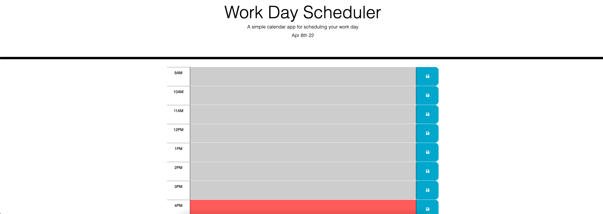

# scheduler-challenge

## Purpose
Build a scheduler that can help an employee manage their time effectively.

## Built with
* HTML
* CSS
* JS
* JQUERY
* BOOTSTRAP
* MOMENT.JS

## Website
https://browniecharl.github.io/scheduler-challenge/

## Contribution
Made by Robert Velez